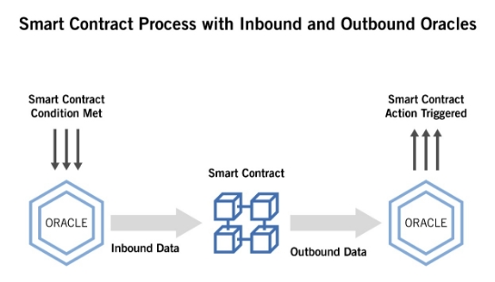

**Problem**

- Delay in settling of crop insurance claims under the Pradhan Mantri Fasal Bima Yojana 
- Rejection of crop insurance claims under the Pradhan Mantri Fasal Bima Yojana 

**Introduction**

The insurance industry is heavily dependent on several processes executed among multiple entities, such as insurer, insured, and third-party services. The increasingly competitive environment is pushing insurance companies to use advanced technologies to address multiple challenges, namely lack of trust, lack of transparency, and economic instability. To this end, we use blockchain as an emerging technology that enables transparent and secure data storage and transmission. In our solution, we propose, a collaborative blockchain-based crop insurance system for monitoring and processing the insurance transactions. Our solution aims at automating the insurance policy processing, claim handling, and payment using smart contracts to minimize the delay and rejection of crop insurance claims under the Pradhan Mantri Fasal Bima Yojana.

The generic existing insurance systems require manual interactions across different transaction processes resulting in slow processing and lengthy payment settlement time. We can solve this directly by using Smart Contracts. For example, insurance policies can be transformed into smart contracts that will eventually help in automating claim processing, verification, and payment. It will provide several-fold advantages, for instance, saving time, reducing costs, and preventing potential fraud.

Indeed, a smart contract can be written to register farmers interested in purchasing policies offered by the insurers (Private Insurance Companies with Agriculture Insurance Company under PMFBY), enable them to follow their claims, and automatically receive refunds. More precisely, a smart contract is provided to insurers to team up, pool their contributions/premiums, and protect each other. This smart contract includes a set of the created insurance policies which are the agreements among the insurers and the insured (Farmers). The insurance policy is mapped into a smart contract that communicates with external oracles in order to automatically invoke a new claim and transfer to the insured (i.e., the insurance policy smart contract’s owner) the claimed amount. 

The main idea is to develop a continuous monitoring and processing collaborative insurance system by (i) managing the collected money of the insurers using a smart contract to eliminate the need to trust the involved insurance parties, (ii) implementing the insurance policies and the claims as smart contracts, and (iii) deploying the contracts in a distributed platform using blockchain for both automating the execution of the agreement between the insurer and the insured as well as (iv) recording all the insurance transactions in a transparent and tamper-proof manner.

The reasons behind using the blockchain technology are: to guarantee that the collaborative insurance model is followed by each participant, to improve the insurance transaction transparency, to guarantee the non-repudiation principle conformity among several untrustworthy collaborative entities, to automate and speed up business processes in the insurance industry from the insured registration till the claim handling, and to reduce administrative and operational costs by eliminating manual interactions across insurance system entities.

**Application and Working**

To know about the application and working of our project we first need to understand some basic terminologies. 

**Blockchain:** Blockchain is a distributed and chronological database of transactions where the transactions are stored in blocks. It is almost impossible to tamper with the blocks in blockchain and thus it can be trusted. Trust is built in blockchain without the need for a central authority. Such a distributed ledger can contain digital or physical assets that can be shared in a network throughout many institutions and geographical locations where all members of the network must have their identical copy of the ledger.

**Smart Contracts:** Smart contracts are computer programs deployed on the blockchain. They are triggered and perform pre-defined actions when specific conditions are met. The smart contract functions will always respond when invoked and they cannot be censored or altered once deployed. Smart contracts gave network automation and the ability to convert paper contracts into digital contracts. Compared to traditional contracts, smart contracts enabled users to codify their agreements and trust relations by providing automated transactions without the supervision of a central authority. It is also worth mentioning that smart contracts cannot communicate directly with the external systems, thus this communication is carried out by oracles. 

**Oracles:** Oracles are used to gather information from the real-world and invoke automatically the smart contract pertaining to the claim. For instance, in crop insurance, an oracle can periodically check climate condition, then a smart contract can read these external data, and trigger a payment to refund the insured farmers in case of a local calamities. Insure chain is another interesting proposal that is based on a smart contract which includes the rules associated with setting the premium and the settlement verification. The verification of reimbursement conditions is based on the services of an oracle whose task is to certify the corresponding weather data and ensuring its authenticity. Using oracles can speed up claim handling and reduce manual administrative mistakes.

**System Model for Crop Insurance System**                                                                                      

\1. **Insured (Farmers):** This entity is interested in purchasing policies offered by an insurer in order to be covered (depending on the type of insurance). In case of a claim request, the insured can receive refunds from the insurer (subject to verification).                                                        

\2. **Insurer (Private Insurance Companies with Agriculture Insurance Company under PMFBY):** This entity is represented by a smart contract shared among several people (e.g., government, banks, insurance companies, etc.). These people collaborate together to pool their contributions/premiums and protect each other by refunding any farmer facing a situation that warrants a refund. The refunded entity is then required to contribute to the fund that is used to pay future claims. This smart contract provides insurance for the insured by proposing multiple insurance policy types. Each insurance policy determines the claims that the insurer is legally required to pay. To reduce manual interactions, claim requests are automatically invoked after notifications/warnings are sent by third-party web APIs.                                                                

\3. **Third-Party Web APIs:** These entities provide specialized services that are useful to invoke claim requests; In case of a dispute between the insurer and the insured, there may be a need for an auditor. 

\4. **Auditor**: This entity investigates and audits the insurance transactions stored on the blockchain to settle some legal dispute between the insurer and insured. The blockchain enabled distributed platform facilitates the auditor’s task, thanks to the salient features of blockchain, i.e., transparency, tamper-proof, and the non-repudiation.

**Blockchain-Based Framework for Crop Insurance**

**Proposed Smart Contracts**: In order to automate the execution of the agreement between the insurer (Private Insurance Companies with Agriculture Insurance Company under PMFBY) and the insured (Farmers), three smart contracts are proposed: InsurancePool, InsurancePolicy, and Claim.

The smart contract’s functions are executed when a set of predefined conditions are satisfied.

**InsurancePool smart contract***:* It is hosted on the blockchain and used by multiple clients interested in proposing multiple insurance offers. The InsurancePool smart contract is designed to enable several insurers (Private Insurance Companies with Agriculture Insurance Company under PMFBY) to collaborate on a common project (PMFBY) that offers a collaborative insurance to refund the insured (Farmers) for possible damage(s) during designated incidents.

**InsurancePolicy smart contract:** It is created for the farmers interested in purchasing policies offered by the insurer and hosted on the blockchain. The InsurancePolicy smart contract is designed to enable the insured, known as the policyholder, to hold a machine-readable and self-enforcing insurance policy. This smart contract defines a set of functions, which allows farmers to pay the premium, cancel the existing policies, claim insurance amount (this function creates/deploys automatically a new instance of the Claim smart contract).

**Claim smart contract*:*** It is created by an InsurancePolicy smart contract and hosted on the blockchain. The Claim smart contract is designed to automate the claim processing, verification, and payment. This smart contract defines a set of functions, authorize function that enables the insurer to update the status of the claim from “Created” to “Open” or to “Rejected”. TriggerPayment function that is automatically invoked in order to refund the claimed amount and ask for closing the claim, closeClaim function that is automatically invoked once the insured is refunded by updating the claim’s status to “Closed”, and cancelClaim function that enables the insured to cancel a claim, then the claim status is updated to “Canceled” and the claim is canceled.

After the smart contract’s functions are executed, we can easily -                                                                  

- Track when a crop insurance claim is settled                                                                                                      
- Track when the insurance company disburses the insurance claim                                                                        
- Track when the settlement amount is credited to the farmers bank account.

**Development Phases of a Smart Contract**

**Designing a token.** For creating smart contracts, the Ethereum network allows users to develop their own tokens to execute specific functions. The trick here is to properly determine what functions to execute and what business logic to include.

**Implementing the smart contract.** Ethereum provides a virtual environment called the Ethereum Virtual Machine. Ethereum smart contracts are built using the Solidity programming language, an object contract-oriented, high-level language specially designed for implementing smart contracts.

**Testing.** Smart contracts should be deployed to the blockchain network to run. But this may cause certain difficulties with testing. Auto tests are a good solution. By emulating a real environment, auto tests verify that a smart contract works as expected.

**Acceptance and review.** Even though there are no actual verification standards for smart contracts, there are special environments for developers to verify their smart insurance code and logic. An honest review and acceptance process should cover cost-effectiveness, including many reviewers and providing visibility of results.

**Deployment.** Now it’s time to deploy the smart contract to the Ethereum blockchain so that everyone can use it. There are specific tools to speed up deployment, but in general, developers have to submit contract code to the blockchain where the transaction will wait to be mined. After it’s mined, the contract is considered deployed.

**Support.** An insurance company that operates blockchain technology should have their own or outsourced resources to maintain the infrastructure of their smart contracts.

**Smart Contract Life Cycle Phases**

**Creation.** The parties agree on the contract’s contents and objectives. Next, the agreement is turned into code via the development phases described above.

**Freezing.** After a smart contract appears on the blockchain, it becomes public and accessible through the public ledger. At this stage, both contractors have to meet all the requirements of the contract, pay a fee, or send an asset to execute the blockchain further. Moreover, transfers made to the wallet address defined in the smart contract are frozen until all preconditions are met.

**Execution.** When the smart contract executes, it results in new transactions that are once again stored in the distributed ledger. These transactions are then validated by the consensus protocol.

**Finalization.** A smart contract is considered finalized after assets have been unfrozen and all transactions have been confirmed.

**Features** 

**Less fraud through transparency.** This particular advantage of smart contracts in crop insurance is possible because of the decentralized and open nature of blockchains. With no owner, anyone can see any transaction logged in a blockchain database. If any changes to insurance smart contracts are made, all parties will see it and no inconsistencies will be missed.

**Task automation.** With the blockchain, all smart contract-related processes are automated and rendered securely. Eliminating the need for mediators and human input is the key benefit of using smart contract insurance. This lessens the risk of manipulation by third-party participants. Moreover, applied for smart contracts insurance, blockchain allows companies to review their procedures and processes in a more transparent and convenient way.

**Save time on verifying claims.** Blockchain smart contracts in insurance completely replace the claims process. No other documents are needed: only predefined rules to settle claims. Faster processes, increased efficiency, and lower costs — nothing but benefits for insurers.

**Protect policy documents.** Insurers can store policy documents on numerous ledgers, making it virtually impossible to lose them. Thanks to their technical characteristics, smart contracts prevent data loss and damage.

**Risk assessment.** Blockchains let insurance companies include state-of-the-art risk assessment models into their smart contracts. This logic relies on a blockchain-based ID system. IDs are instantly verified and supplemented with new data, eliminating the time-consuming stages of traditional identity verification. A smart contract reads all information related to an individual and automatically assesses risks, saving time and effort on data collection and verification.

**Constraints** 

**Limited contract scope.** The most significant constraint that can spoil the benefits of using smart contracts in insurance is the necessity to cover every eventuality in a contract’s code. Things that can be done relatively easily on paper can be difficult to translate into code. Especially because the majority of companies start building smart contracts with the simplest models, using the pattern *if X occurs, then Y will happen.*

**Technological complexity.** Building a sophisticated blockchain smart contract in crop insurance requires a particular level of programming skills. First of all, only specialists well-versed in Ethereum can create a well-run smart contract. Naturally, it’s quite a challenging task since the technology is quite complicated and involves an in-depth understanding of software development.

**Possible bugs in code.** Smart contracts are tricky. Since they’re executed sequentially, if at least one vital piece is missing, the contract won’t run. Even though the elimination of the human input is among the top advantages of smart contracts in insurance, smart contracts still require human involvement at the development stage. And don’t forget that to err is human.

**Uncertainty of legal regulations.** It’s no secret that the insurance industry is among the most regulated. But despite the keen interest in blockchain technology shown by government institutions, smart contracts are still largely unregulated. So how to make a smart contract and use it in insurance in a legally sound way remains unclear.

**Issues**

**Development:** Although it is simple to automate a transaction, it is difficult to code in a smart contract what happens when parties to a contract do not perform as they are expected to or are simply in breach of a term of the contract.

**Migration:** Farmers and Government will be reluctant to use blockchain and smart contracts because of its complexity. Farmers will opt for a basic Web2 application which will show basic information regarding their premiums and claims. They don't wish to deal with so much complexity. It will be hard to migrate them to a blockchain based Insurance System. They need to realize this system is better than the existing systems in every way and in long terms it would be beneficial for them.

**Insurers:** It would be hard for government to convince all the insurers (Private Insurance Companies with Agriculture Insurance Company under PMFBY) to collaborate and migrate together. There might be multiple reasons for insurers not to participate in.

**Integration:** It would hard for government to integrate this blockchain based insurance system with existing systems or to create a new one. But as government is realizing the potential of blockchain in the near future we can see future government systems built in Blockchain.

**Legal:** Smart contracts will most likely introduce new challenges in the legal landscape. The main value of a smart contract can be attributed to automated performance that can’t be altered. In insurance, this automation can complicate things.

**Conclusion**

In the next five years, we see smart contracts in the insurance sector being developed in relation to short term risks where there are clear parameters as to payment, the potential for disputes is low and the claims management process is uncomplicated or pre-determined.

Smart Contracts can not only transform the Crop Insurance System but also it can transform the Agriculture System too. Smart contracts with Blockchain and Internet of Things combinedly can solve problems by providing a distributed network of connected sellers and buyers, ensure traceability of agricultural products from root to retail, ensure temper proof data acquisition from storage, field level, and while distributing, remove intermediate processors and controlling market prices, gaining more control with automation of the process while removing intermediate third-party processors. These were few more added features of Smart Contracts to enhance the life of Indian Farmers.

Perhaps the main obstacle to smart contracts becoming the norm in the insurance market is that decision makers may not commit sufficient human and financial capital to their development. As smart contracts represent more of a revolution than an evolution in the way business is transacted, they will require significant strategic long-term resources committed to their development.

# WeInsure-SOH

